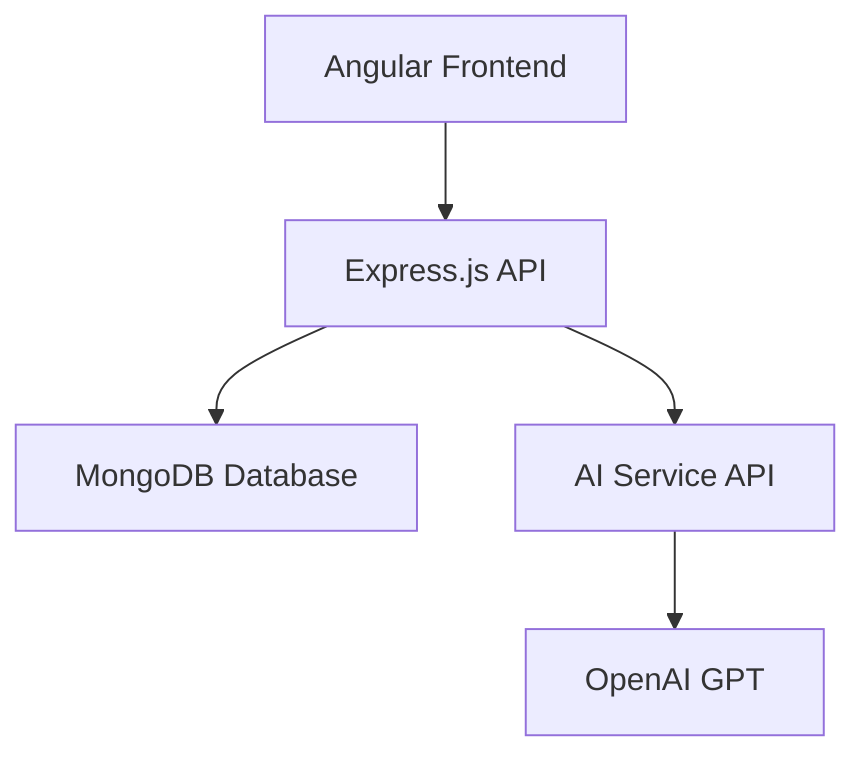

# AI Decision Justification Tracker

An AI-powered full-stack web application built with the MEAN stack (MongoDB, Express.js, Angular, Node.js) that helps users learn from past decisions by retrospectively analyzing the reasoning and assumptions behind decisions and comparing them with real outcomes.

## Project Overview

This application focuses on decision reflection and learning rather than prediction. Users can log decisions with their context, reasoning, and expected outcomes, then later record what actually happened. The AI then performs a retrospective analysis to compare expectations with reality, identify incorrect assumptions, and extract lessons learned.

## Features

### Backend (Node.js + Express)
- RESTful API with JWT-based authentication
- MongoDB integration for data persistence
- Decision and User models with proper validation
- AI integration for retrospective analysis
- Secure input validation and error handling

### Frontend (Angular)
- Responsive, component-based UI
- User authentication (login/register)
- Decision creation and management
- Outcome recording interface
- AI analysis visualization
- Dashboard with statistics

### AI Integration
- Retrospective analysis comparing expected vs actual outcomes
- Identification of invalid assumptions
- Extraction of lessons learned
- Reflective suggestions for future decisions
- Structured prompt engineering for consistent analysis

## System Architecture



## Folder Structure

```
├── backend/
│   ├── models/
│   │   ├── User.js
│   │   └── Decision.js
│   ├── routes/
│   │   ├── users.js
│   │   └── decisions.js
│   ├── controllers/
│   │   └── decisionController.js
│   ├── services/
│   │   └── aiService.js
│   ├── server.js
│   └── .env
├── frontend/
│   ├── src/
│   │   ├── app/
│   │   │   ├── components/
│   │   │   │   ├── login/
│   │   │   │   ├── register/
│   │   │   │   ├── dashboard/
│   │   │   │   ├── decision-form/
│   │   │   │   ├── outcome-form/
│   │   │   │   └── decision-detail/
│   │   │   ├── services/
│   │   │   ├── models/
│   │   │   ├── app.config.ts
│   │   │   └── app.routes.ts
│   │   └── styles.scss
│   ├── angular.json
│   └── package.json
└── README.md
```

## Installation and Setup

### Prerequisites
- Node.js (v16 or higher)
- MongoDB (local or cloud instance)
- OpenAI API key (for AI analysis features)

### Backend Setup

1. Navigate to the project root directory:
   ```
   cd ai-decision-tracker
   ```

2. Install backend dependencies:
   ```
   npm install
   ```

3. Create a `.env` file in the root directory with the following variables:
   ```
   PORT=5000
   MONGODB_URI=mongodb://localhost:27017/ai-decision-tracker
   JWT_SECRET=your_jwt_secret_key
   AI_API_KEY=your_openai_api_key
   ```

4. Start the backend server:
   ```
   npm run dev
   ```

### Frontend Setup

1. Navigate to the frontend directory:
   ```
   cd frontend
   ```

2. Install frontend dependencies:
   ```
   npm install
   ```

3. Start the Angular development server:
   ```
   npm start
   ```

4. Access the application at `http://localhost:4200`

## API Endpoints

### Authentication
- `POST /api/users/register` - Register a new user
- `POST /api/users/login` - Login user

### Decisions
- `POST /api/decisions` - Create a new decision
- `GET /api/decisions` - Get all decisions for user
- `GET /api/decisions/:id` - Get a specific decision
- `PUT /api/decisions/:id/outcome` - Update decision with actual outcome
- `POST /api/decisions/:id/analyze` - Trigger AI analysis for a decision
- `DELETE /api/decisions/:id` - Delete a decision

## AI Prompt Design

The AI analysis uses structured prompts to ensure consistent, valuable retrospectives:

```
You are an expert decision analyst. Your task is to perform a retrospective analysis of a decision 
by comparing what was expected with what actually happened. Focus on learning and reflection, 
not prediction.

DECISION DETAILS:
Title: [Decision Title]
Context: [Context/Description]
Reasoning: [Reasoning Behind Decision]
Assumptions Made: [List of Assumptions]
Expected Outcome: [Expected Outcome]
Actual Outcome: [Actual Outcome]
Success Level (1-5): [Success Rating]
Unexpected Factors: [List of Unexpected Factors]

Please provide a structured analysis with the following sections:

1. COMPARISON ANALYSIS:
   Compare the expected outcome with the actual outcome. What were the key differences?

2. INVALID ASSUMPTIONS:
   Identify which assumptions were proven incorrect or invalid based on what actually happened.

3. LESSONS LEARNED:
   What key lessons can be extracted from comparing expectations with reality?

4. REFLECTIVE SUGGESTIONS:
   Based on this analysis, what suggestions would you make for future similar decisions? 
   Focus on reflective improvements, not predictive advice.
```

## Usage Workflow

1. **User Registration/Login**: Users create an account or log in to access the system
2. **Decision Creation**: Users log a new decision with:
   - Title
   - Context/description
   - Reasoning
   - Assumptions
   - Expected outcome
3. **Outcome Recording**: When results are known, users record:
   - Actual outcome
   - Success level (1-5)
   - Unexpected factors
4. **AI Analysis**: The system automatically analyzes the decision or users can manually trigger analysis
5. **Learning Review**: Users review the AI-generated insights:
   - Expectation vs reality comparison
   - Invalid assumptions identified
   - Lessons learned
   - Suggestions for future decisions
6. **Dashboard**: Users can view all decisions and track learning progress

## Code Quality

- Clean, modular, and well-commented code
- Scalable folder structure
- Production-ready but easy to understand
- Consistent naming conventions
- Proper error handling throughout
- Security best practices implemented

## Contributing

This project is designed for educational purposes. Feel free to fork and modify for your own learning.

## License

MIT License